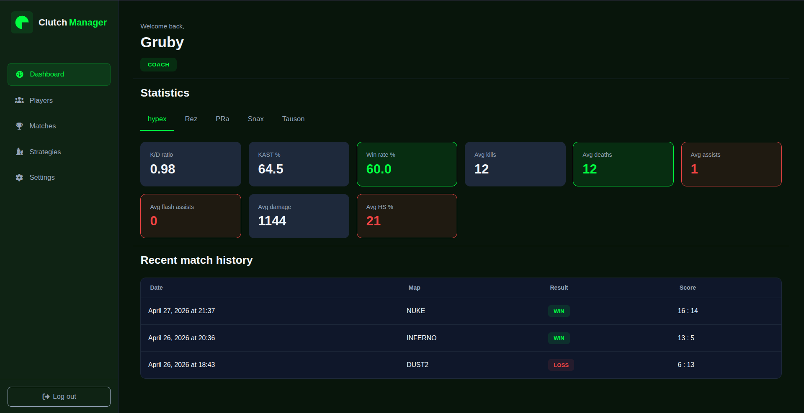
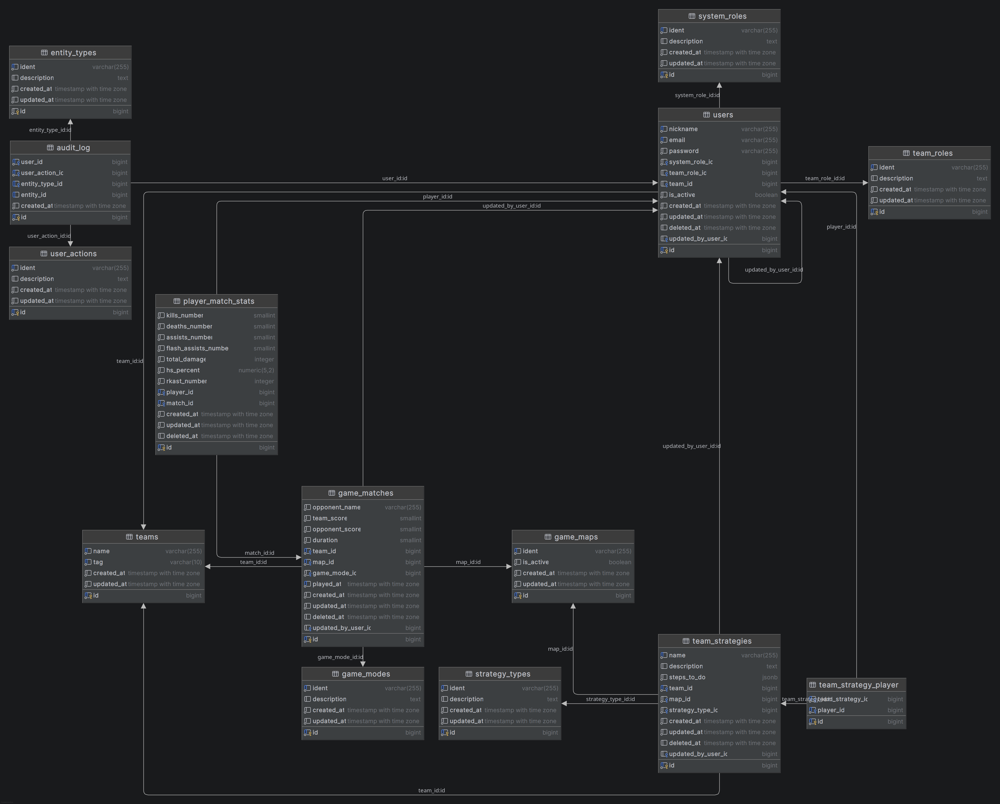

# Clutch Manager

> A web-based CS2 esports team management system built with PHP 8, PostgreSQL, and TypeScript — no frameworks, pure MVC.



---

## Table of Contents

- [Project Overview](#project-overview)
- [Technologies](#technologies)
- [Features](#features)
- [User Roles & Access Control](#user-roles--access-control)
- [MVC Architecture](#mvc-architecture)
- [Project Structure](#project-structure)
- [Database Schema](#database-schema)
- [Getting Started](#getting-started)
- [Environment Variables](#environment-variables)
- [Running Tests](#running-tests)
- [Security](#security)

---

## Project Overview

**Clutch Manager** is a full-stack web application for managing a CS2 esports team. It allows coaches and admins to record matches, track player statistics, and build tactical strategies — all within a role-based access control system.

The project is implemented without any backend or frontend frameworks, relying solely on PHP 8 OOP with an MVC architecture, native PostgreSQL queries via PDO, and TypeScript compiled to ES modules.

---

## Technologies

| Layer | Technologies |
|---|---|
| **Backend** | PHP 8.3 (OOP, no framework), MVC architecture |
| **Database** | PostgreSQL 16 — 3NF, views, functions, triggers, transactions |
| **Frontend** | HTML5, CSS3 (media queries), TypeScript (ES6), Fetch API |
| **DevOps** | Docker, docker-compose, Nginx |
| **Testing** | PHPUnit 11, dg/bypass-finals |
| **Build** | tsc (TypeScript compiler, watch mode via Node container) |

---

## Features

### Players module
- Add, edit, deactivate, and delete players
- Filter by team role (IGL, AWP, Entry, Support, Lurker) and activity status
- Assign players to strategies

### Matches module
- Record match results with per-player statistics (kills, deaths, assists, flash assists, total damage, HS%, RKAST)
- Auto-generate realistic stats based on player role and match outcome
- View match details with stat badges (+/−)
- Soft delete with cascading stats removal

### Strategies module
- Create and manage team strategies per map and type (Attack, Defense, Eco, Default)
- Assign up to 5 players per strategy
- Step-by-step execution plan stored as JSONB
- Unique constraint per team + strategy name

### Dashboard
- **Player/Coach view** — personal stats, win rate, K/D, last 3 matches
- **Admin view** — team aggregates with pagination, full audit log

### Settings
- Edit nickname, email, and team role
- Change password with session regeneration
- Coach can create a team (auto-generated unique tag)

---

## User Roles & Access Control

| Role | Players | Matches | Strategies | Teams | Dashboard |
|---|---|---|---|---|---|
| **PLAYER** | Read (own team) | Read | Read + edit players | — | Personal stats |
| **COACH** | Full CRUD (own team) | Full CRUD (own team, ≥5 active players) | Full CRUD (own team) | Create own team | Team stats |
| **ADMIN** | Full access | Full access | Full access | Read all | All teams + audit log |

Access is enforced at the **service layer** — `Auth::requireRole()` and per-method `assertAccess()` checks. HTTP responses follow REST conventions: `401 Unauthorized`, `403 Forbidden`, `404 Not Found`, `500 Internal Server Error`.

---

## MVC Architecture



**Key architectural decisions:**

- `DashboardController` is the only controller that renders HTML — all others return JSON exclusively.
- `ServiceContainer` acts as a DI container with singleton instances — no `new` calls inside controllers.
- Business logic lives entirely in the Service layer; controllers are thin dispatch wrappers.
- `Core\Auth` — all methods are `static`; used as middleware before every protected route.
- `Core\Response` — all error payloads follow `{ success, statusCode, errorMessage }`.

---

## Project Structure

```
.
├── core/
│   ├── Database.php          # PDO singleton + transaction()
│   ├── Router.php            # HTTP routing, _method override, URL params
│   ├── Session.php           # start(), regenerate(), setUserField()
│   ├── Auth.php              # isLoggedIn, requireRole, userId, teamId
│   ├── Response.php          # json(), redirect(), view(), error()
│   └── ServiceContainer.php  # DI container — 11 repos + 10 services
├── src/
│   ├── Controller/           # BaseController + 10 controllers
│   ├── Enum/                 # SystemRole, TeamRole
│   ├── Model/                # readonly models with fromRow() + toArray()
│   ├── Repository/           # PDO data access, buildConditions(), soft delete
│   └── Service/              # Business logic, validation, authorization
├── public/
│   ├── assets/
│   │   ├── css/              # BEM, CSS variables, media queries
│   │   └── ts/               # TypeScript modules (compiled → assets/js/)
│   │       ├── helpers/      # apiFetch, pagination, custom-select, sidebar-nav
│   │       ├── players.ts
│   │       ├── matches.ts
│   │       ├── match-details.ts
│   │       ├── strategies.ts
│   │       ├── strategy-details.ts
│   │       ├── dashboard-user.ts
│   │       ├── dashboard-admin.ts
│   │       └── user-settings.ts
│   └── views/                # PHP-rendered HTML views
├── docker/
│   ├── db/init/              # SQL migrations (001–009)
│   ├── nginx/                # Nginx config
│   ├── php/                  # PHP 8.3 + Composer (multi-stage)
│   └── node/                 # tsc --watch
├── tests/
│   └── Unit/Service/
│       └── AuthServiceTest.php
├── index.php                 # Bootstrap + all route definitions
├── autoload.php              # PSR-4: Core\, Src\, Tests\
├── composer.json
├── tsconfig.json
├── package.json
└── docker-compose.yaml
```

---

## Database Schema



The schema satisfies **Third Normal Form (3NF)** and includes:

- **Dictionary tables** — `game_maps`, `game_modes`, `system_roles`, `team_roles`, `strategy_types` (identified by `ident` — uppercase slug)
- **Core tables** — `teams`, `users`, `game_matches`, `player_match_stats`, `team_strategies`, `team_strategy_player`
- **Audit tables** — `audit_log`, `entity_types`, `user_actions`

**Notable design decisions:**

- Match result (WIN/LOSS/DRAW) is never stored — it is derived from `team_score` vs `opponent_score` at query time (3NF).
- `hs_percent NUMERIC(5,2)`, `rkast_number INT` (rounds with kill/assist/survive — not a percentage).
- `steps_to_do JSONB` format: `[{ order: int, description: string }]`.
- All destructive operations use **soft delete** (`deleted_at`) — `users`, `game_matches`, `team_strategies`.
- `UNIQUE(team_id, name)` on `team_strategies` prevents duplicate strategy names per team.
- `player_match_stats` has `UNIQUE(match_id, player_id)` and `ON DELETE CASCADE`.

**SQL views:**

| View | Purpose |
|---|---|
| `v_player_dashboard` | Per-player stats filtered by `player_id` |
| `v_coach_dashboard` | Aggregated team stats filtered by `team_id` |
| `v_admin_dashboard` | Cross-team aggregates |
| `v_admin_audit_log` | Full audit log with JOINs, no filter |

**Functions & triggers:**

- `fn_player_kd()` and `fn_player_win_rate()` — reusable `STABLE` functions.
- Audit triggers on `game_matches`, `team_strategies`, `users` — actor read from `updated_by_user_id`.

---

## Getting Started

### Prerequisites

- [Docker](https://www.docker.com/) + [docker-compose](https://docs.docker.com/compose/)
- Git

### Installation

```bash
# 1. Clone the repository
git clone https://github.com/your-username/clutch-manager.git
cd clutch-manager

# 2. Copy the environment file
cp .env.example .env
# Edit .env with your credentials (see Environment Variables below)

# 3. Start all services
docker compose up -d
```

The app will be available at **http://localhost:8080/auth/login** ().

### Stopping the project

```bash
docker compose down
```

### Full reset (wipes the database)

```bash
docker compose down -v && docker compose up -d
```

### Useful commands

```bash
# PHP logs
docker compose logs php

# Database logs
docker compose logs db

# TypeScript compiler output
docker compose logs node

# Direct database access
docker compose exec db psql -U default -d clutch_manager

# List tables
docker compose exec db psql -U default -d clutch_manager -c "\dt"

# PHP version
docker compose exec php php --version

# Node version
docker compose exec node node -v

# PostgreSQL version
docker compose exec db psql -U default -d clutch_manager -c "SELECT version();"
```

### Dev seed accounts

After first boot the database is seeded with three ready-to-use accounts:

| Role | Email           | Password     |
|---|-----------------|--------------|
| ADMIN | admin@clutch.gg | `Admin1234!` |
| COACH | gruby@clutch.gg | `Coach1234!` |
| PLAYER | snax@clutch.gg  | `Password1!` |

---

## Environment Variables

Copy `.env.example` to `.env` and fill in the values before starting.

```dotenv
# Database
POSTGRES_HOST=db
POSTGRES_PORT=5432
POSTGRES_DB=clutch_manager
POSTGRES_USER=default
POSTGRES_PASSWORD=123admin

# App
APP_ENV=development       # development | production
APP_SECRET=your_secret    # used for session security
```
---

## Running Tests

Tests are executed inside the PHP container using PHPUnit 11.

```bash
# Run all tests
docker compose exec php vendor/bin/phpunit

# Or via composer script
docker compose exec php composer test
```

### Test coverage

| Test | What it verifies |
|---|---|
| `testLoginWithInvalidPassword` | Returns 401 on wrong credentials |
| `testRegisterWithDuplicateEmail` | Returns 409 on duplicate email |
| `testRegisterPlayerWithoutTeamRole` | Returns 400 when PLAYER has no team role |

PHPUnit 11 is installed via Composer (multi-stage Docker build). The `dg/bypass-finals` extension allows mocking `final` classes without modifying production code. The `vendor/` directory is isolated in a named Docker volume so the host filesystem does not override container-installed dependencies.

---

## Security

| Mechanism | Implementation |
|---|---|
| Password hashing | `password_hash()` / `password_verify()` with bcrypt |
| SQL injection prevention | PDO prepared statements with named placeholders throughout |
| Session security | `HttpOnly`, `SameSite=Lax`, `session_regenerate_id()` after login and password change |
| Access control | Role checks in the service layer (`Auth::requireRole`), not just the controller |
| Input validation | Validated and sanitized before any persistence operation |
| Soft delete | `deleted_at` timestamp — no hard deletes on users, matches, or strategies |
| Audit log | Append-only `audit_log` table with triggers on sensitive tables |
| Error responses | Structured `{ success, statusCode, errorMessage }` |